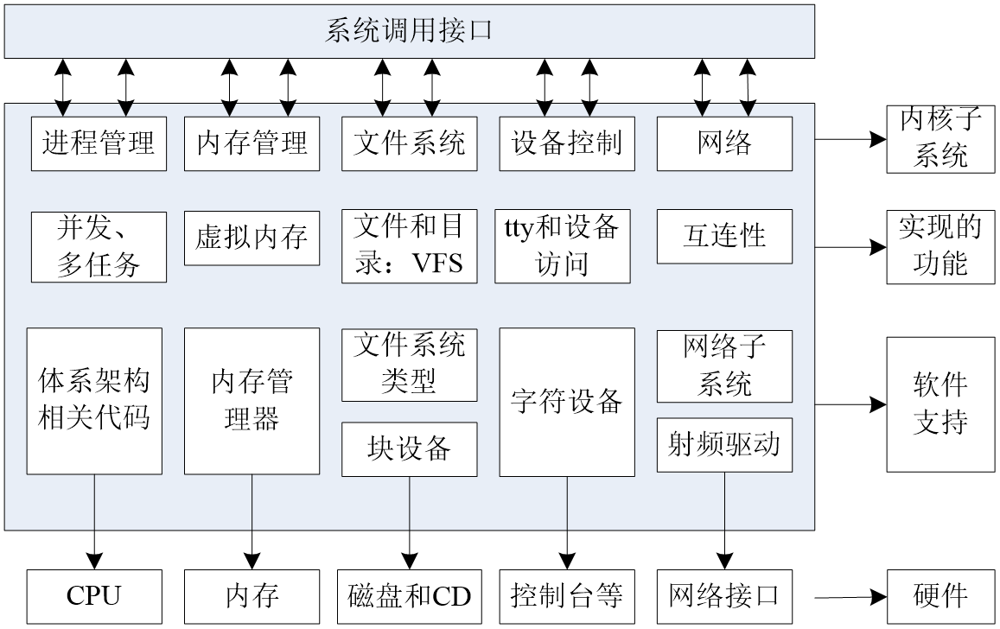

# Unin/Linux操作系统介绍
1. 操作系统的目标
    * 方便：使计算机系统易于使用
    * 有效：以更有效的方式使用计算机系统资源
    * 扩展：方便用户有效开发、测试和引进新功能

2. 操作系统的地位
    * 操作系统在计算机系统中承上启下的地位，向下封装硬件，向上提供操作接口。
    * 图解
        

3. Unix操作系统发展历史
    * 1965：贝尔实验室（Bell Labs）加入一项由通用电气和麻省理工学院合作的计划，该计划要建立一套多使用者、多任务、多层次的MULTICS操作系统。后来因为项目太为复杂失败。
    * 1969：其主要开发者Thompson（后被称为UNIX之父）和Ritchie领导一组开发者，开发了一个新的多任务操作系统—UNICS，后来被改名为Unix，最初的Unix是用B语言和汇编语言混合编写而成。
    * 1971：两人在贝尔实验室共同发明了C语言，并于1973用C语言重写了Unix。
    * 1974：UNIX第一次出现在贝尔实验室以外。此后UNIX被政府机关，研究机构，企业和大学注意到，并逐渐流行开来。
    * 1980：有两个最主要的Unix的版本线，一个是Berkeley的BSD UNIX，另一个是AT&T的Unix，两者的竞争最终引发了Unix的战争，最终导致Unix出现各种各样的变种。
    * 1982：AT&T基于版本7开发了UNIX System Ⅲ的第一个商业版本，并不再开源。
    * 1992~2001：由于版权问题，AT&T公司与BSD开发组开始了一场将近10年的版权官司。UNIX由于其昂贵的费用，仅局限于大型机的应用；BSD因为版权问题，失去了宝贵的发展时期。
4. Linux操作系统发展历史
    * Minix（mini-UNIX）最初是由Andrew Tanenbaum教授，仿照4.3BSD的源代码，白手起家完成了12000行C语言的编写工作这个系统只是一个教学工具，没有什么实际应用价值。
    * 1990年，Linus Torvalds决定编写一个自己的Minix内核，初名为Linus' Minix，意为Linus的Minix内核，后来改名为Linux，此内核于1991年正式发布，并逐渐引起人们的注意。
    * Linux操作系统的诞生、发展、和成长过程依赖于五个重要支柱：unix操作系统、minix操作系统、GNU计划、POSIX标准和互联网。
    * GNU计划：GNU是“GNU is Not Unix”的递归缩写，由Richard M.Stallman于1984年创办,旨在开发一个免费、类unix的操作系统-GNU系统及其开发工具；Emacs编辑系统、BASH shell程序、GCC、GDB等开发工具都是GNU组织的产品。
    * 1992年Linux与其他GNU软件结合，完全自由的操作系统正式诞生。该操作系统往往被称为“GNU/Linux”或简称Linux。
    * POSIX标准：POSIX标准定义了操作系统应该为应用程序提供的接口标准，POSIX标准用来统一Unix、Linux各分支编程接口，以提高其通用型和可移植性。
5. linux与unix的联系
    * UNIX系统是工作站上最常用的操作系统，它是一个多用户、多任务的实时操作系统，允许多人同时访问计算机， 并同时运行多个任务。UNIX系统具有稳定、高效、安全、方便、功能强大等诸多优点，自20世纪70年代开始便运行在许多大型和小型计算机上。
    * UNIX虽然是一个安全、稳定且功能强大的操作系统，但它也一直是一种大型的而且对运行平台要求很高的操作系统，只能在工作站或小型机上才能发挥全部功能，并且价格昂贵，对普通用户来说是可望而不可及的，这为后来Linux的崛起提供了机会，Linux是一个类UNIX操作系统。
    * Linux是免费的、不受版权制约、与UNIX兼容的操作系统。
    * Linux在x86架构上实现了UNIX系统的全部特性，具有多用户多任务的能力，同时保持了高效性和稳定性，Linux具有如下的优秀的特点：
        1. 开放性；
        2. 完全免费；
        3. 多用户；
        4. 多任务；
        5. 良好的用户界面；
        6. 设备独立性；
        7. 提供了丰富的网络功能；
        8. 可靠的系统安全性；
        9. 良好的可移植性。

6. 内核版本和发行版本
    1. 内核版本
        * 内核(kernel)是系统的心脏，是运行程序和管理像磁盘和打印机等硬件设备的核心程序，它提供了一个在裸设备与应用程序间的抽象层。
        * Linux内核版本又分为稳定版和开发版，两种版本是相互关联，相互循环：
            * 稳定版：具有工业级强度，可以广泛地应用和部署。新的稳定版相对于较旧的只是修正一些bug或加入一些新的驱动程序。
            * 开发版：由于要试验各种解决方案，所以变化很快。
        * 内核源码网址：http://www.kernel.org，所有来自全世界的对Linux源码的修改最终都会汇总到这个网站，由Linus领导的开源社区对其进行甄别和修改最终决定是否进入到Linux主线内核源码中。
    2. 发行版本
        * Linux发行版 (也被叫做 GNU/Linux 发行版) 通常包含了包括桌面环境、办公套件、媒体播放器、数据库等应用软件。
        * 这些操作系统通常由Linux内核、以及来自GNU计划的大量的函式库，和基于X Window的图形界面，在X Window中用户同样可以通过使用鼠标对窗口、菜单等进行操作来完成相应的工作。
        * X Window系统是一个非常出色的图形窗口系统，是类UNIX系统的图形用户界面的工业标准。X Window系统最重要的特征之一就是它的结构与设备无关。
        * X Window系统的主要特点有如下几点：
            * X Window系统是客户机/服务器结构的。X Window的实现是与操作系统内核分开的，其主要由X Server和X Client两部分组成。
            * X Window系统不是Unix/Linux操作系统的必须的构成部分，而只是一个可选的应用程序组件。

7. linux设计领域介绍
    1. Unix/Linux服务器
        * 是目前Unix/Linux应用最多的一个领域，可以提供Web、FTP、Gopher、SMTP/POP3、Proxy/Cache、DNS等服务器，支持服务器集群，支持虚拟主机、虚拟服务、VPN等。
    2. 嵌入式Linux系统
        * 嵌入式Linux是将流行的Linux操作系统进行剪裁修改，能够在嵌入式计算机系统上运行的一种操作系统。Linux嵌入式系统能够支持多种CPU和硬件平台，性能稳定，剪裁性好，开发和使用容易。其中包括Embedix、uCLinux、muLinux等。
    3. 桌面应用
        * 近年来，Linux系统特别强调在桌面应用方面的改进，并且已达到相当的水平，完全可以作为一种集办公应用、多媒体应用、网络应用等多方面功能于一体的图形界面操作系统，在办公应用方面，Unix/Linux集成了openOffice、SUN公司的StarOffice以及KOffice等工具。
    4. 电子政务
        * 随着Linux的快速发展，Linux已逐渐成为Windows系统重要的竞争力量。尤其是Linux在安全性方面的独特优势，又使得Linux在政府应用领域得到很大的发展。目前一些国家正将其电子政务系统向Linux平台迁移。中国政府也对Linux给予极大的支持。

