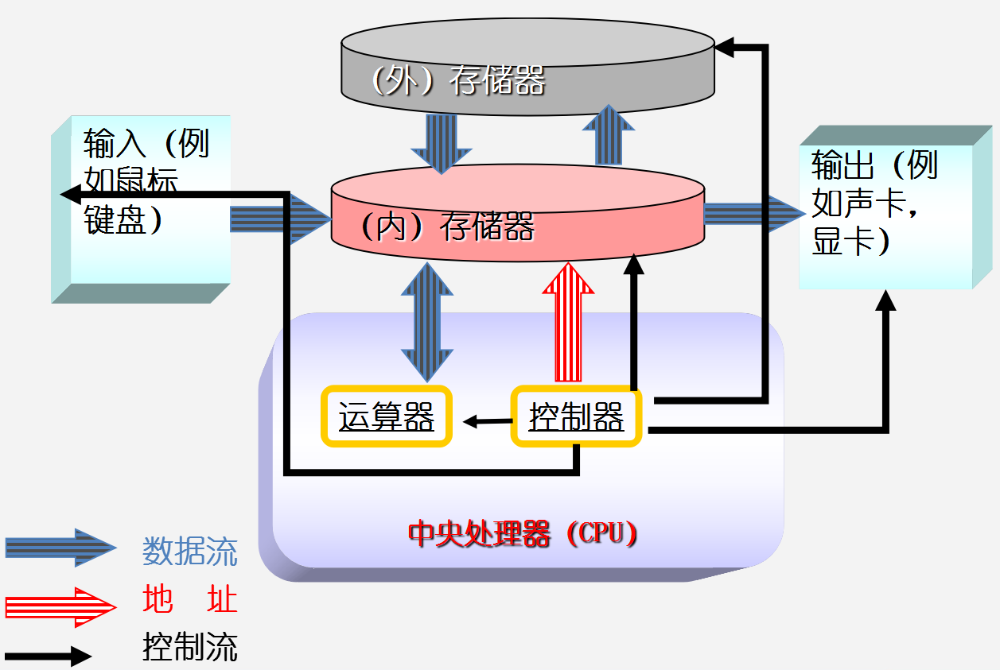
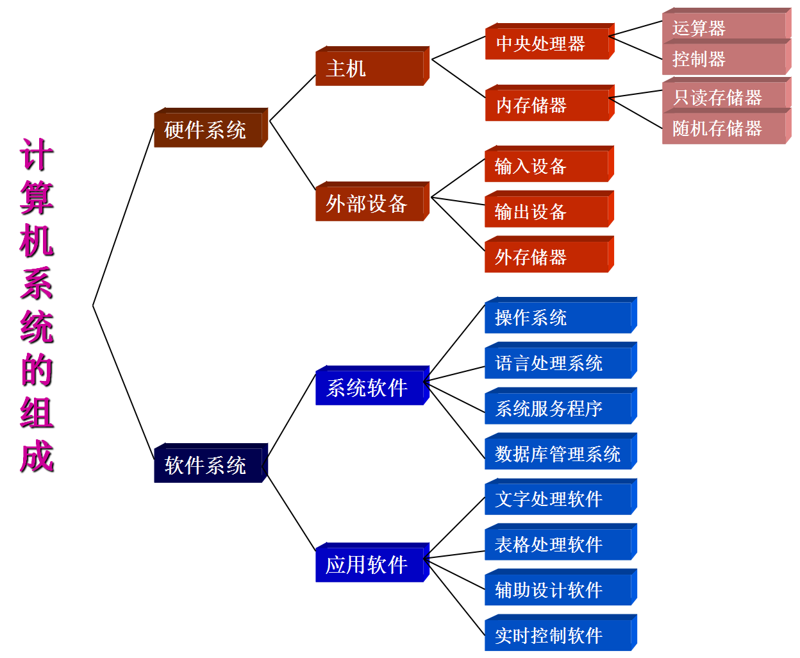
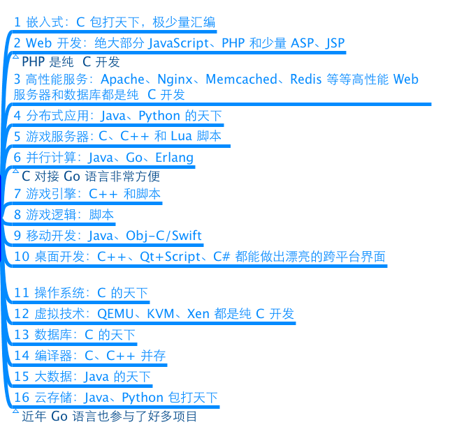
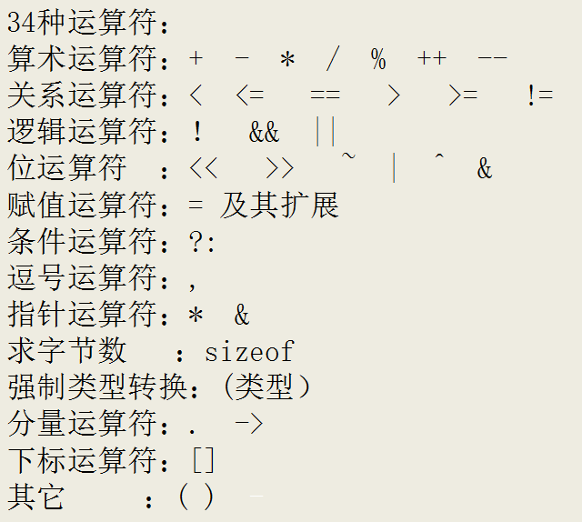
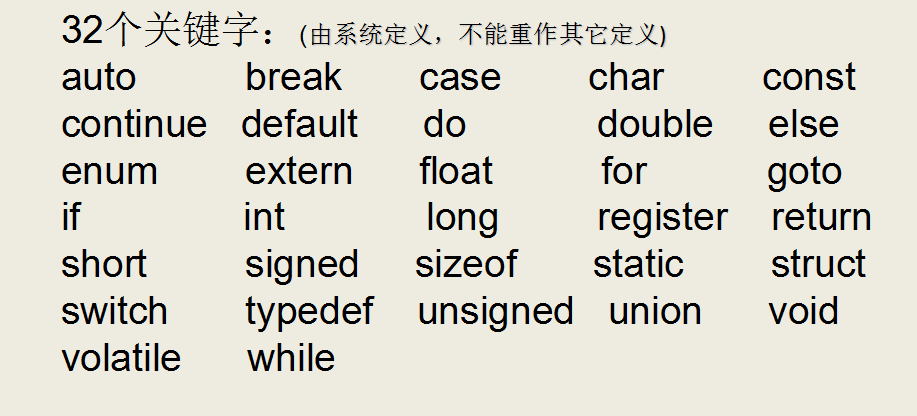
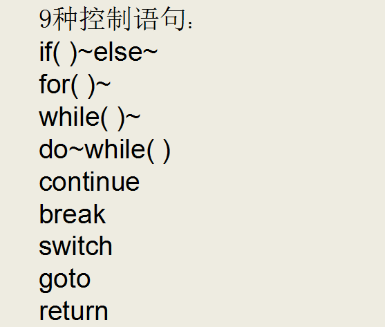

# C语言概述
## 什么是计算机语言
* 一提到语言这个词语，自然会想到的是像英语、汉语等这样的自然语言，因为它是人和人交换信息不可缺少的工具。
* 而今天计算机遍布了我们生活的每一个角落，除了人和人的相互交流之外，我们必须和计算机角落。
* 用什么的什么样的方式和计算机做最直接的交流呢？人们自然想到的是最古老也最方便的方式——语言，而C语言就是人和计算机交流的一种语言。
* 语言是用来交流沟通的。有一方说，有另一方听，必须有两方参与，这是语言最重要的功能：
    * 说的一方传递信息，听的一方接收信息；
    * 说的一方下达指令，听的一方遵循命令做事情。
* 语言是人和人交流，C语言是人和机器交流。只是，人可以不听另外一个人，但是，计算机是无条件服从。
* 语言有独特的语法规则和定义，双方必须遵循这些规则和定义才能实现真正的交流。

## 计算机结构组成

## 计算机系统组成

## 程序和指令
* 指令是对计算机进行程序控制的最小单位
* 所有的指令的集合称为计算机的指令系统。
* 程序是为完成一项特定任务而用某种语言编写的一组指令序列。
    * 操作码： 机器执行什么操作
    * 操作数： 执行对象，具体数，存放位置

## 语言发展历程
1. 机器语言
    * 计算机的大脑或者说心脏就是CPU，它控制着整个计算机的运作。每种CPU，都有自己的指令系统。这个指令系统，就是该CPU的机器语言。

    * 机器语言是一组由0和1系列组成的指令码，这些指令码，是CPU制作厂商规定出来的，然后发布出来，请程序员遵守。

    * 要让计算机干活，就得用机器语言(二级制数)去命令它。这样的命令，不是一条两条，而是上百条。而且不同型号的计算机其机器语言是不相通的，按着一种计算机的机器指令编制的程序，不能在另一种计算机上执行。

2. 汇编语言和编译器
    * 机器语言编程是不是很令人烦恼呢，终于出现了汇编语言，就是一些标识符取代0与1。一门人类可以比较轻松认识的编程语言。
    * 只是这门语言计算机并不认识，所以人类还不能用这门语言命令计算机做事情。这正如如何才能让中国人说的话美国人明白呢？——翻译！
    * 所以，有一类专门的程序，既认识机器语言，又认识汇编语言，也就是编译器，将标识符换成0与1，知道怎么把汇编语言翻译成机器语言。

3. 高级语言
    * 汇编语言和机器语言都是面向机器的，机器不同，语言也不同。既然有办法让汇编语言翻译成机器语言，难道就不能把其他更人性化的语言翻译成机器语言？
    * 1954年，Fortran语言出现了，其后相继出现了其他的类似语言。这批语言，使程序员摆脱了计算机硬件的限制，把主要精力放在了程序设计上，不在关注低层的计算机硬件。这类语言，称为高级语言。
    * 同样的，高级语言要被计算机执行，也需要一个翻译程序将其翻译成机器语言，这就是编译程序，简称编译器。
    * 这类高级语言解决问题的方法是分析出解决问题所需要的步骤，把程序看作是数据被加工的过程。基于这类方法的程序设计语言成为面向过程的语言。C语言就是这种面向过程的程序设计语言。

## C语言优缺点
1. 优点
    * 代码量小
    * 执行速度快
    * 功能强大
    * 编程自由
2. 缺点
    * 写代码实现周期长
    * 可移植性差
    * 过于自由,经验不足容易出错
    * 对平台库依赖较多

## C语言应用领域
* C语言的应用极其广泛，从网站后台，到底层操作系统，从多媒体应用到大型网络游戏，均可使用C语言来开发：
	* C语言可以写网站后台程序
	* C语言可以专门针对某个主题写出功能强大的程序库
	* C语言可以写出大型游戏的引擎(游戏引擎Cocos)
	* C语言可以写出另一个语言来
	* C语言可以写操作系统和驱动程序，并且只能用C语言编写
	* 任何设备只要配置了微处理器，就都支持C语言。从微波炉到手机，都是由C语言技术来推动的
* 图解
    

## C语言简洁的语法
* C语言仅仅只有32个关键字,9中流程控制语句,34中运算符,却能够完成无数的功能.
    * 
    * 
    * 
