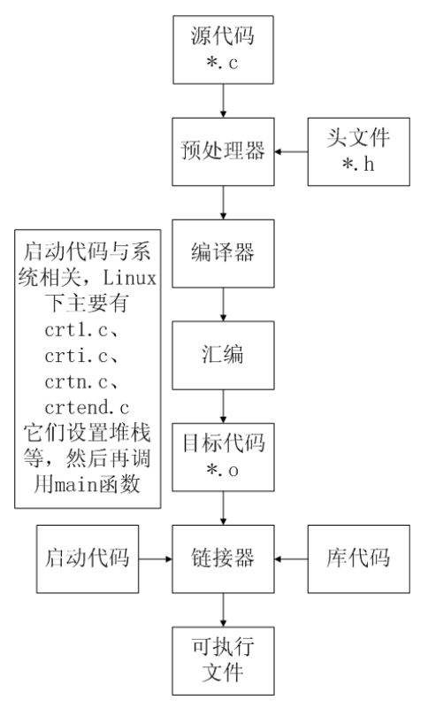
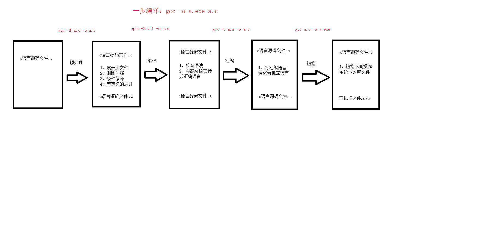
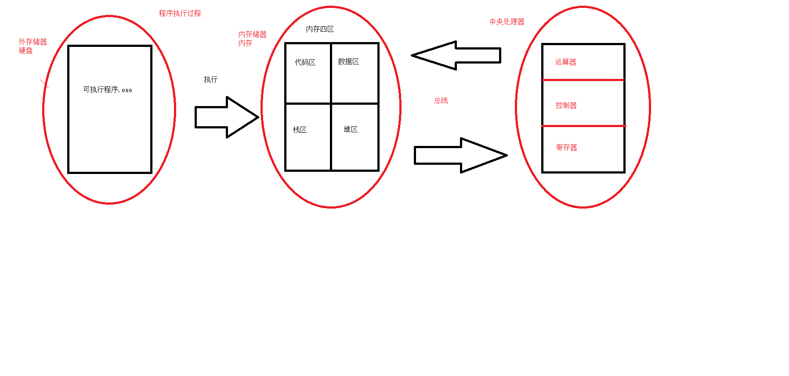

# C语言编译流程
## C程序编译步骤
1. C 代码编译为可执行程序经过4步
    1. 预处理：宏定义展开、头文件展开、条件编译等，同时将代码中的注释删除，这里并不会检查语法
    2. 编译：检查语法，将预处理后文件编译生成汇编文件
    3. 汇编：将汇编文件生成目标文件(二进制文件)
    4. 链接：C语言写的程序是需要依赖各种库的，所以编译之后还需要把库链接到最终的可执行程序中去

2. 图解
    

3. 分步编译过程
    ```
    预处理：gcc -E hello.c -o hello.i
    编  译：gcc -S hello.i -o hello.s
    汇  编：gcc -c hello.s -o hello.o
    链  接：gcc hello.o -o hello.exe
    ```
4. 编译过程图解
    

5. 程序执行过程
    