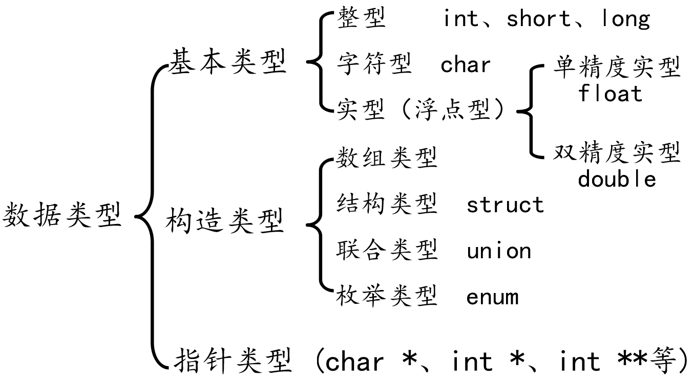

# 变量和常量

## 数据类型
* 数据类型的作用：编译器预算对象(变量)分配的内存空间大小
    

### 常量字面量
* 基本描述
    * 在程序运行过程中，其值不能被改变的量
    * 常量一般出现在表达式或赋值语句中
* 常量类型
    * 整形常量
        * 100， 200， 300， 0
    * 实形常量
        * 3.14, 0.124, 
    * 字符型常量
        * 'a', 'b', '1', '\n'
    * 字符串常量
        * "abc", "123456"

## 变量
1. 基本描述
    * 在程序运行过程中，其值可以在一定范围呢发生改变
    * 变量在使用前必须先定义，定义变量前必须有相应的数据类型
2. 标识符命名规则
    * 标识符不能是关键字
    * 标识符只能由字母，数字，下划线组成，不能以数字开头
    * 标识符中字母区分大小写
    * 见名知意
    * 不能和同一作用于内的标识符重名
3. 变量特点
    * 变量在编译时为其分配相应的内存空间
    * 可以通过其名字和地址访问相应内存
4. 变量的声明和定义的区别
    * 声明变量不需要建立存储空间，如extern int a;
    * 定义变量需要建立存储空间，如int b;
    * 一般情况下吧建立存储空间的声明称之为定义，而把不需要
建立存储空间的声明称之为声明

## 常量定义
1. 常量的定义
    1. `const 数据类型 常量名`
    2. `#define PI 3.1415926`
2. 注意
    1. 通过#define定义的常量是根据值来匹配数据类型的
    2. const修饰的常量是不安全的，可以通过指针来修改
