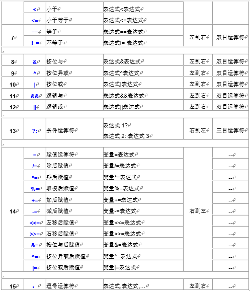

# 运算符与表达式
## 运算符分类
* 算术运算符	用于处理四则运算
* 赋值运算符	用于将表达式的值赋给变量
* 比较运算符	用于表达式的比较，并返回一个真值或假值
* 逻辑运算符	用于根据表达式的值返回真值或假值
* 位运算符	用于处理数据的位运算
* sizeof运算符	用于求字节数长度

## 算数运算符
* +	正号
* -	负号
* +	加
* -	减
* *	乘
* /	除
* %	取模(取余)
* ++	前自增
* ++	后自增
* --	前自减
* --	后自减

## 赋值运算符
* =	赋值
* +=	加等于
* -=	减等于
* *=	乘等于
* /=	除等于
* %=	模等于

## 比较运算符
* ==	相等于
* !=	不等于
* <	小于
* \>	大于
* <=	小于等于
* >=	大于等于

## 逻辑运算符
* !	非	!a	如果a为假，则!a为真；
    * 如果a为真，则!a为假。
* &&	与	a && b	如果a和b都为真，则结果为真，否则为假。
* ||	或	a || b	如果a和b有一个为真，则结果为真，二者都为假时，结果为假。

## 运算符优先级
* 运算符优先级顺序
    * 
    * 

## 类型转换
* 数据有不同的类型，不同类型数据之间进行混合运算时必然涉及到类型的转换问题。
* 两种转换方法
    1. 自动转换(隐式转换)
        * 遵循一点的规则，由编译系统自动完成，系统自动将占用空间低的数据类型转换成占用空间高的数据类型，转换后数据正确
    2. 强制类型转换
        * 把表达式的运算结果强制转换成所需的数据类型
* 类型转换原则
    * 占用内存字节数少的类型，向占用内存字节数多大类型转换，以保证精度不降低
    `char, short -> signed int -> unsigned int -> long -> long`
* 强制转换
    * 强制类型转换指的是使用强制类型转换运算符，将一个变量或者表达式转化成所需的类型，基本语法如下: `(类型说明符) (表达式)`
