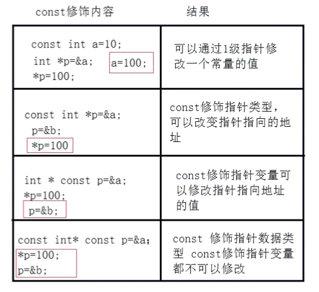

# 指针
## 概述
1. 内存相关概念
    * 存储器：计算机的组成中，用来存储程序和数据，辅助CPU进行运算处理的重要部分。
    * 内存：内部存贮器，暂存程序/数据——掉电丢失 SRAM、DRAM、DDR、DDR2、DDR3。
    * 外存：外部存储器，长时间保存程序/数据—掉电不丢ROM、ERRROM、FLASH（NAND、NOR）、硬盘、光盘。

2. 内存是沟通CPU与硬盘的桥梁
    * 暂时存放CPU中的运算数据
    * 暂存与硬盘等外部存储器交换的数据

3. 物理存储器和存储地址空间
    * 物理存储器： 实际存在的具体存储器芯片
        * 主板上装插的内存条
        * 显示卡上的显示RAM芯片
        * 各种适配卡上的RAM芯片和ROM芯片
    * 存储地址空间: 对存储器编码的范围,我们在软件上常说的内存是指这一层含义
        * 编码: 对每个物理存储单元(一个字节)分配一个号码
        * 寻址: 可以根据分配的号码找到相应的存储单元,完成数据的读写
    
4. 内存地址
    1. 将内存抽象成一个很大的一维字符数组
    2. 编码就是对内存的每一个字节分配一个32位或者64位的编号(与32位或者64位处理器有关)
    3. 这个编号我们称之为内存地址
        * 内存中每一个数据都会分配相应的地址

5. 指针和指针变量
    * 内存区的每一个字节都有一个编号,这就是内存地址
    * 如果在程序中定义了一个变量,在对程序进行编译或运行时,系统就会给这个变量分配内存单元,并确定他的内存编号,
    * 指针的实质就是内存地址,指针就是地址,地址就是指针
    * 指针时内存单元的编号,指针变量是存放地址的变量
    * 通常我们叙述时会把指针变量简称为指针,实际上他们的含义不一样

## 指针基础知识
1. 指针变量的定义和使用 
    * 指针也是一种数据类型,指针变量也是一种变量
    * 指针变量指向谁,就把谁的地址复制给指针变量
    * \* 操作符操作的是指针变量指向的内存空间
2. 例子
    1. 指针变量的定义
        ```
            int a = 10;
            a = 10;
            int b = 100;
            int * p = &a;   // 指针是一种数据类型,p时指针类型变量,用来指向一个变量的地址
        ```
    2. 通过变量修改指针指向地址的值
        ```
        int b = 200;
        int * p = &b;
        *p = 20;
        ```
    3. sizeof()指针类型在内存中的大小,32->4字节,64->可能8字节
        ```
        printf("%u\n",sizeof(int *));  // 4
        ```

## 野指针空指针
1. 野指针
    * 指针变量也是变量,时变量就可以任意赋值,不要越界就可以(32位位4字节,64位为8字节),但是,任意数值赋值给指针变量没有意义,因为这样的指针就变成了野指针,此指针指向的区域是未知的(操作系统是否允许允许操作此指针指向的内存区域),所以,野指针不会直接引发错误,操作野指针指向的内存区域才会出现问题.
    * 例
        ```
        int a = 100;
        int * p;
        p = a;          // 把a的值复制给指针变量p,p为野指针,不会有任何问题
        p = 0x12345678; // 给指针变量p赋值,p为野指针,ok不会有问题
        *p = 100        // 试图操作野指针指向位置区域的内存,error
        ```

2. 空指针
    * 但是,野指针和有效指针变量保存的都是数值,为了标记此指针变量没有指向任何变量(空闲可用),C 语言中,可以把NULL赋值给此指针,这样就标志此指针为空指针,没有任何指向
    * int * p = NULL;
    * NULL是一个值为0的宏常量 `#define NULL ((void *)0)`
    * 注意
        * 空指针就是指向内存编号为0的空间,操作该内存空间也会报错,一般用于条件判断

3. 万能指针void *
    * void * 指针可以指向任意类型变量的内存空间
        ```
        void * p = NULL;
        int a = 10;
        p = (void *)&a;  // 指向变量时,最好转换为void *
        
        // 使用指针变量指向的内存时,必须转换为相应类型
        *((int *)p) = 11;
        ```
    * 注意
        ```
        int a = 10;
        char * p = &a;  // 不需要强制转换，能够直接赋值，千万要注意
        *p = 100;       // 不会出错，在范围内
        *(int *)p = 1000;
        ```
        ```
        int arr[10] = {1,2,3};
        char *p = arr;
        *(int *)p = 1000;
        *((int *)p + 1) = 2000;
        ```

4. const修饰的指针变量
    * 如果const修饰* 不能修改指针变量指向的内存地址的值,如果const修饰变量不能修改指针的指向.
        ```
        int a = 100;
        int b = 200;

        // 指向常量的指针
            // 修饰*,指针指向的内存区域不能修改,指针指向可以改变
        const int * p1 = &a;    // 等价于 int const * p1 = &a;
        
        // 指针常量
            // 修饰变量 指针指向不能修改,指针指向的内存可以修改
        int * const p1 = &a;

        // 既不能修改指向,也不能修改值
        const int * const p1 = *a;
        ```
        * 图解
            * 
    * 可以使用const修饰变量来创建指针
        * 通过指针修改const修饰的常量
            ```
                // 这种方式不安全,可以通过指针修改
                const int a = 100;
                int * p = &a;
                *p = 100;
            ```