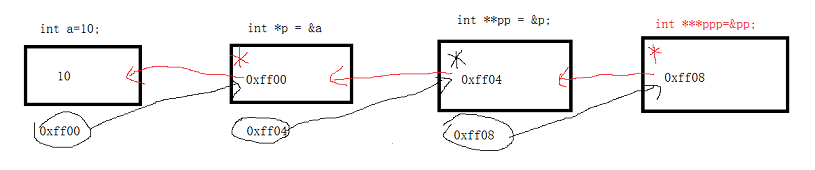

# 指针数组和多级指针
## 指针数组
* 指针数组，他是数组，数组的每一个元素都是指针类型
    ```
    int *p[3];
    int a = 1;
    int b = 2;
    int c = 3;

    p[0] = &a;
    p[1] = &b;
    p[2] = &c;

    for(int i = 0; i < sizeof(p)/sizeof(p[0]); i++)
    {
        printf("%d", *p[i]);
    }
    ```
* 字符指针数组，因为字符串相当于是一个地址，地址可以按照数组来操作
    ```
    char * arr[] = {"hello","world","nihao", "goog luck"};
    printf("%c", *(arr[1] + 2))
    ```

## 多级指针
* C语言中允许有多级指针的存在，在实际的程序中一级指针最常用，其次是二级指针。
* 二级指针就是指向一个一级指针变量地址的指针。同理，三级指针就是存储二级指针的地址
* 图解
    * 
* 结论：
    * 几级指针加上几个*就是变量的值
    * 指针的级数-指针前的*数就是相对应的几级指针的值
    