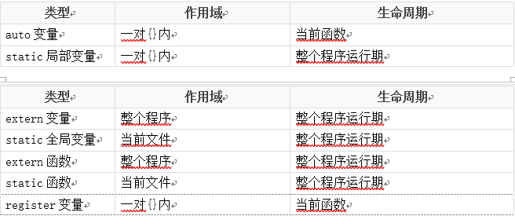

# 作用域
* C语言变量的作用于分为
    * 代码块作用域，代码块是{}之间的一段代码
    * 函数作用域
    * 文件作用域

## 局部变量
* 局部变量也叫做auto自动变量(auto可写可不写)，一般情况下代码块{}内部定义的变量都是自动变量，有如下特点
    * 在一个函数内定义，只在函数范围内有效
    * 在复合语句中定义，只在复合语句中有效
    * 随着函数调用的结束或符合语句的结束局部变量的声明周期也结束
    * 如果没有赋初值，内容为随机
* 例如
    ```
        void test()
        {
            auto int b = 10;
        }
        
        int main(void)
        {
            if(1)
            {
                int a = 10;
                printf("a = %d",a);
            }
        }
    ```

## 静态局部变量(static)
1. static 局部变量的作用域也是在定义的函数内有效
2. static 局部变量的声明周期和程序运行周期一样，同时static局部变量的值只初始化一次，但可以赋值很多次
3. static局部变量若未赋初始值，则由系统自动赋值，数值型变量自动赋初始值0，字符型变量赋空字符。

## 全局变量
* 在函数外面定义，可被本文件及其他文件中的函数所共用，若其他文件中的函数调用此变量，须用extern声明
* 全局变量的声明周期和程序运行周期一样
* 不同文件的全局变量不可以重名

## 静态(static)全局变量
* 在函数外定义，作用范围被限制在所定义的文件中
* 不同文件静态全局变量可以重名，但作用域不冲突
* static全局变量的声明周期和程序运行周期意昂，同时static全局变量的值只会初始化一次

## extern全局变量声明
* `extern int a;` 声明一个变量，这个变量在别的文件中已经定义了，这里只是声明，而不是定义。

## 全局函数和静态函数
* 在C语言中函数默认都是全局的，使用关键字static可以将函数声明为静态，函数定义为static就意味着这个函数只能在定义这个函数的文件中使用，在其他文件中不能调用，即使在其他文件中声明这个函数都没用。
* 对于不同文件中的static函数名字可以相同
* 注意：
    * 允许在不同的函数中使用相同的变量名，他们代表不同的对象，分配不同的单元，互相不会干扰
    * 同一源文件中，允许全局变量和局部变量同名，在局部变量的作用于内，全局便阿玲不起作用
    * 所有的函数默认都是全局的，意味着所有的函数都不能重名，但是如果是static函数，那么作用于是文件级别，所以不同的文件static函数命名是可以相同的

## 图解
* 