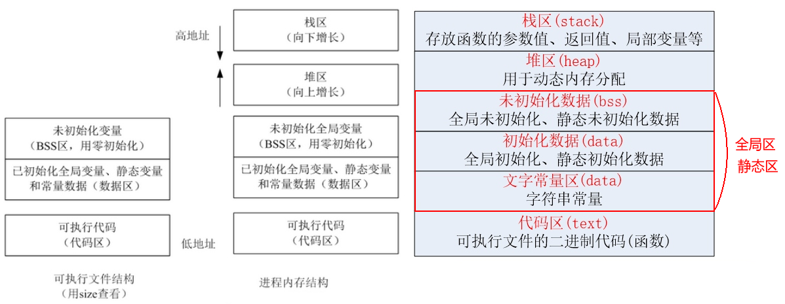
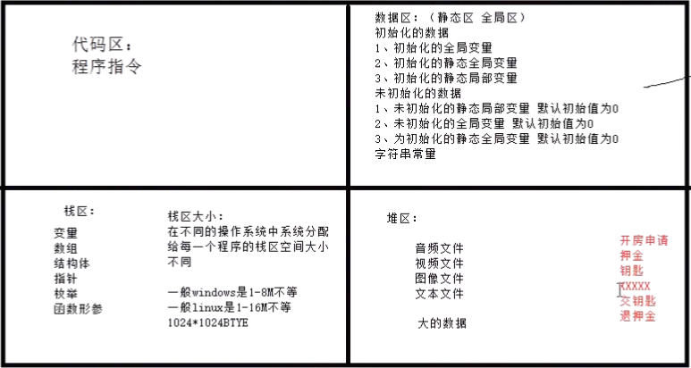
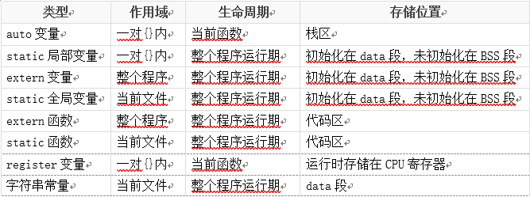
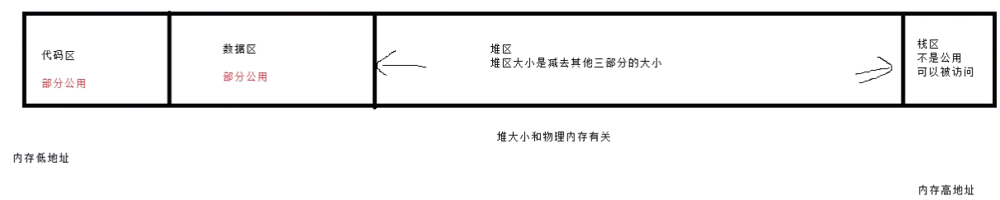

# 内存布局
## 内存分区
1. C代码经过预处理，编译，汇编，链接4步后生成一个可执行文件。
2. 在Linux下面，程序是一个普通的可执行文件，可以使用file命令列出文件的基本情况(文件类型等)，可以使用size命令列出此二进制可执行文件结构情况。
    * size命令输出解析
        1. text -> 代码区
        2. data -> 静态数据/全局初始化数据区
        3. bss -> 未初始化数据区
        4. dec,hex -> 十进制总和，十六进制总和
        5. filename -> 文件名
        
    * 可知，在没有运行程序之前，也就是说程序没有加载到内存前，可执行程序内部已经分好了3段信息，分别为代码区(text),数据区(data),和未初始化数据区(bss)3个部分(有人直接把data和bss合起来称为静态数据区或者全局区)，当系统加载程序到内存，除了根据可执行程序的信息分出代码区(text),数据区(data)和未初始化数据区(bss)之外，还额外增加了栈区堆区。

3. 内存分区
    1. 代码区(text segment)
        * 存放CPU执行的机器指令，通常代码区是可以共享的(即另外的执行程序可以调用他)，使其可以共享的目的是对于频繁被执行的程序，只需要在内存中有一份代码即可，代码区通常是只读的，使其只读的原因是防止程序意外的修改了他的指令，另外，代码区还规划了局部变量的相关信息。
    2. 全局初始化数据区/静态数据区(data segment)
        * 该区域包含了在程序中明确被初始化的全局变量，已经初始化的静态变量(包括全局静态变量和局部静态变量)和常量数据(如字符串常量)
        * 加载的是可执行文件数据段，存储于数据段(全局初始化，静态初始化数据，文字常量(只读))的数据的生存周期为整个程序的运行期间
    3. 未初始化数据区(又叫bss区域)
        * 存入的是全局未初始化变量和未初始化的静态变量，为初始化的数据取的数据在程序开始执行之前被内核初始化为0或者空(NULL)
        * 程序在加载到内存前，代码区和全局区(data和bss)的大小就是固定的，程序运行期间不能改变，然后，运行可执行程序，系统把程序加载到内存，除了根据可执行程序的信息分出代码区(text),数据区域(data)和未初始化数据取(bss)之外，还额外增加了栈区，堆区
    4. 栈区(stack)
        * 栈是一种先进后出的内存结构，由编译器自动分配释放，存放函数的参数值，返回值，局部变量等等。在程序运行期间实时加载和释放，因此局部变量的生存周期为申请到释放该段占空间
    5. 堆区
        * 堆是一个大容器，他的容量要远远大于栈，但是没有栈那样先进后出的顺序，用于动态内存分配。堆咋内存中位于BSS区和栈区之间，一般由程序员分配和释放，入宫程序员不释放，那么程序结束时由操作系统回收。

* 图解内存结构
    * 
* 内存空间作用图解
    * 
* 布局详解
    * 


## 数据存储范围和内存存储方向
``` 
1. 栈（由高地址向低地址延伸）
2. 堆（由地址值向高地址延伸）
3. BSS
4. data
5. 代码区
```
* 图解
    

