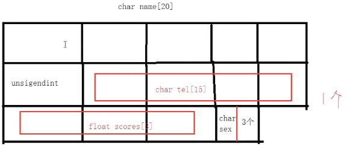
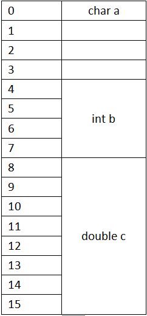
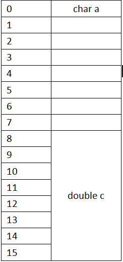
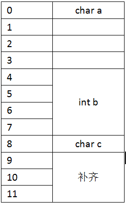
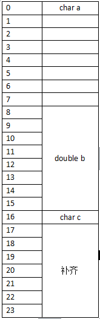

# 结构体大小和内存存储结构
* 可以将结构体声明放在.h文件中，引入就可以定义结构体类型的变量

## 结构体大小
```
struct Student
{
    char name[20];      // 20
    unsigned int age;   // 4
    char tel[15];       // 15
    float scores[3];    // 12
    char sex;           // 1
}                       // 52

sizeof(struct Student);  // 56
```
* 注意： 结构体需要根据数据类型进行内存对齐
    * 找到当前结构体中所需空间最大的数据类型来分隔
* 图解
    * 
* 内存对齐原则
    * 结构体中包含有相同类型或者不同类型的数据类型，如char(1),int(4),double(8),所以结构体内存出现了一个对齐原则
    * 结构体变量中元素是按照定义顺序一个一个放到内存中去的，但是并不是紧密排列的，从结构体存储的首地址开始，每一个元素放置到内存中时，他都会认识内存是以他自己的大小来划分的，因此元素放置的位置一定会在自己宽度的整数倍上开始，以结构体变量首地址为0计算
* 例子
    * 
        * 当char a时，以char自身大小(1字节)划分，a占有了首地址0一个字节，但是当int b时，以int自身大小(四字节)划分，所以b从四字节的非负整数倍开始存储占用四个字节，由于首地址0已经被占用，所以b从第四个地址开始占用四个字节。同理，当double c时，double也已自身大小(8字节)划分内存，而前8个字节(0-7)已经被占用，所以c从第八个地址开始占用8个字节，
    * 
        * 如果去掉中间定义的int b,st2依然会占用16个字节，因为double c时，首地址0已经被占用，c不能从0(8的0倍)开始，那就只能从8的1倍数开始，所以double b之前空着的内存，在内存对齐原则下可以随意增加变量，内存时不会增加的
* 内存补齐原则
    ```
    struct number_4
    {
        char a;    
        int b;
        char c;
    }st4;             // sizeof(st4)  = 12 而不是 4 + 4 + 1
    ```
* 这个时候牵扯到一个补齐原则
    * 在经过对齐原则分析后，检查计算出的存储单元是否为所有元素中所占内存最大的元素的长度的整数倍，是，则结束，若不是，则补齐为他的整数倍
    * 例子
        * 
            * 如图，当4+4+1=9不是结构体中内存最大元素b的整数倍，要补齐成整数倍12
        * 
            * 如果将int换成double,sizeof(st4)=24为最大元素double的整数倍

* 方法总结
    1. 从零偏移出开始，按照字节大小判断，判断此偏移地址是否为该成员变量和对齐参数两者之间的最小值，即min(对齐参数，sizeof()成员)
    2. 若是，则从此处开始占用内存，大小为该类型所占字节数值，若不是，则内存向后偏移到最小值整数倍处，在开始占用空间
    3. 按a,b 两步骤算出结构体实际所占内存时，为了方便后面类型的存储，在向后偏移一位，然后判断该地址是否是默认对齐数域该结构体中最大类型所占字节数的最小值，即:min(默认对齐参数，类型最大字节数)的整数倍，若是，则当前偏移地址的字节数便是结构体大小，若不是，继续向后偏移，直至位最小值整数倍为止。

* 对齐参数如何设置，可以设置为按照任意字节数对齐吗？
    * 解析，在windows中，VS编译器下，默认对齐数位8，在Linux中，默认对齐数位4
    * 设置对齐参数可以在结构体struct之前加上#pragma pack(对齐数)，在struct之后加上#pragma pack;。注意；对齐参数之恩那个是内置类型已有的字节数
        ```
        #pragma pack(4)
        struct A
        {
            int a;
            char b;
            double c;
        }
        #pragma pack;
        ```
* 如何知道结构体某个成员相对于结构体其实位置的偏移量
    * 使用offsetof宏来判断结构体中成员的偏移地址。使用offsetof宏需要包含stddef.h文件，定义如下
        * `#define offsetof(type,member) (size_t)&(((type*)0)->member`
            * 巧妙之处在于将地址0强制转换为type类型指针，从而定位到member在结构体中偏移位置，编译器认为0是一个有效地址，从而认为0是type指针的起始位置